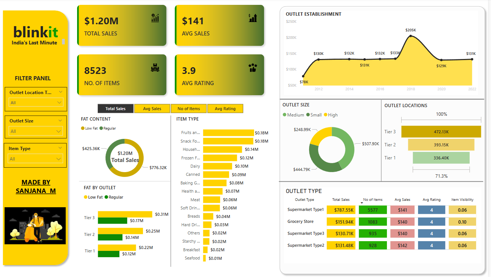

# BlinkIT Grocery Data Analysis



## 📊 Project Overview
This repository contains data analysis and visualization for BlinkIT, India's last-minute grocery delivery service. The dashboard provides insights into sales performance, outlet distribution, and product categories across different store types and locations.

## 🔑 Key Metrics
- **Total Sales**: $1.20M
- **Average Sales**: $141
- **Number of Items**: 8,523
- **Average Rating**: 3.9

## 📋 Dataset Description
The dataset contains detailed information about grocery items sold through BlinkIT outlets, including:

- Item fat content (Low Fat/Regular)
- Item identifiers and types (Fruits, Vegetables, Frozen Foods, etc.)
- Outlet information (Establishment year, Location type, Size)
- Item visibility and weight
- Sales figures
- Customer ratings

## 📈 Dashboard Features
The interactive dashboard provides visualizations for:
1. Sales distribution by item type
2. Sales performance by outlet tier
3. Outlet establishment trends over time
4. Performance comparison between outlet types
5. Distribution of outlet sizes
6. Performance metrics by location tiers

## 📁 Files in this Repository
- `BlinkIT Grocery Data.xlsx`: Raw dataset with all grocery items data
- `BLINKIT_ANALYSIS.pbix`: Power BI dashboard file
- Various PNG files containing chart exports from the analysis

## 🔍 Insights
- Fruits and Vegetables ($0.18M) and Snack Foods ($0.18M) are the top-selling categories
- Tier 3 outlets generate the highest sales at $0.31M, followed by Tier 2 ($0.14M) and Tier 1 ($0.22M)
- Supermarket Type1 is the most common outlet type with the highest sales ($787.55K)
- Medium-sized outlets account for approximately $507.90K in sales
- There was a peak in outlet establishment performance around 2018-2019

## 🚀 Getting Started

### Prerequisites
- Microsoft Excel or equivalent spreadsheet software to view the raw data
- Power BI Desktop to open and interact with the PBIX file

### Installation
1. Clone this repository:
```
git clone https://github.com/sanjana-m55/blinkit-analysis.git
```
2. Open the Excel file to view the raw data
3. Open the PBIX file with Power BI Desktop to interact with the dashboard

## 🛠️ Built With
- Microsoft Excel - Data storage and management
- Power BI - Data visualization and dashboard creation

## 👤 Author
- **Sanjana M** - Project Creator

## 📝 License
This project is available for open use. Please provide appropriate attribution if reusing any components.

## 🙏 Acknowledgments
- BlinkIT for the grocery retail concept
- Data provided for educational and analytical purposes
